---
tags:
  - twitter-context
  - conversation-flow
  - session-summary
date: 2026-02-24
---

# 🗺️ Conversation Flow: Twitter Context Phase 1

> [!ABSTRACT]
> **Session:** Twitter Context MVP Scaffolding
> **Goal:** Create a "One-Click" capture loop from Twitter to Obsidian.
> **Status:** Phase 1 Complete (Capture + Visual Indicators).
> **SHA:** `4ac4bdf`
> **Active Skills:** git-flow-automator (v1.0), project-maintainer (v1.0), conversation-flow (v3.3), obsidian-chat-summary (v2.0), wispr-flow-processor (v1.0), session-manager (v1.0), session-checkpoint (v1.0).

```mermaid
graph TD
    classDef research fill:#d1ecf1,stroke:#0c5460;
    classDef implementation fill:#d4edda,stroke:#155724;
    classDef decision fill:#fff3cd,stroke:#856404;
    classDef fail fill:#f8d7da,stroke:#721c24;
    classDef detour stroke-dasharray: 5 5, fill:#fff0f0, stroke:#721c24;
    classDef checkpoint fill:#e2d1f9,stroke:#5a2ca5;

    Start(("Session Start <a href='#2026-02-24_154500-session-start'>🏷️</a>")):::checkpoint
    Scaffold["Scaffold Infra & Bridge <a href='#2026-02-24_154500-session-start'>🐙</a>"]:::implementation
    ManifestBug(["Manifest Icon Error <a href='#2026-02-24_155500-bug-fix'>🐞</a>"]):::detour
    FixManifest["Fix Manifest (Minimal JS) <a href='#2026-02-24_155500-bug-fix'>🐙</a>"]:::implementation
    BridgeRefactor["Refactor Bridge (GET Route/Logs) <a href='#2026-02-24_160500-refactor'>🐙</a>"]:::implementation
    CORSError(["CORS Loopback Blocked <a href='#2026-02-24_162500-fix'>🐞</a>"]):::detour
    RelayImpl["Implement Background Relay <a href='#2026-02-24_162500-fix'>🐙</a>"]:::implementation
    CaptureSuccess{{"Capture Verified in Vault <a href='#2026-02-24_162500-fix'>§</a>"}}:::research
    BadgeImpl["Implement Visual Emojis <a href='#2026-02-24_163500-session-wrap'>🐙</a>"]:::implementation
    Refinements["Formalize Session Tagging (v1.8) <a href='#2026-02-24_164500-standards'>🐙</a>"]:::implementation
    End(("Phase 1 Complete <a href='#2026-02-24_164500-session-wrap'>🏷️</a>")):::checkpoint

    Start --> Scaffold
    Scaffold --> ManifestBug
    ManifestBug --> FixManifest
    FixManifest --> BridgeRefactor
    BridgeRefactor --> CORSError
    CORSError --> RelayImpl
    RelayImpl --> CaptureSuccess
    CaptureSuccess --> BadgeImpl
    BadgeImpl --> Refinements
    Refinements --> End
```

## 📜 Session Breakdown

- **Environment:** Initialized a three-tier project structure (Infra, Vault, Meta) following the Assistant standard.
- **Challenge (Manifest):** Extension failed to load initially due to missing boilerplate assets; fixed by stripping to minimal JS.
- **Challenge (CORS):** Chrome blocks direct localhost fetches from web origins. Resolved by moving network logic to a `background.js` relay.
- **Refinement (Tagging):** Formally defined the `YYYY-MM-DD_HHMMSS-description` chat save tagging standard in `ENGINEERING_STANDARDS.md` (v1.8) and reinforced it in the `conversation-flow` and `obsidian-chat-summary` skills.

## 📍 Latest Status & Next Steps
- **Status:** Phase 1 (MVP) is fully functional and pushed to GitHub.
- **Open Loops:** No critical bugs.
- **Next Step:** Enhance UI to allow setting categories (Team/Red-Flag) from the capture popup.
